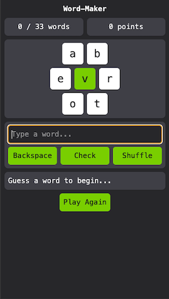

# Word-Maker
This project is a browser version of a puzzle game where players create as many words as possible using the provided letters.

The game adopts the Model-View-Controller (MVC) approach for the code's architecture.

[Try it out.](https://grglls.github.io/word-maker/)

## Screenshots:
|   | <video src="https://github.com/user-attachments/assets/64973ffa-8441-42bd-a4b9-295db0a21ac5" width="30%"></video>
 | <video src="https://github.com/user-attachments/assets/eaa6ee63-4d07-4dd6-ae6b-97c23ad9d96f" width="30%"></video> |
|:---:|:---:|:---:|
| New game | Correct guess | Repeat correct guess |
| <video src="https://github.com/user-attachments/assets/66532ea9-21c7-473f-b28b-5acbc2a3f4ac" width="30%"></video> | <video src="https://github.com/user-attachments/assets/575d5058-ded9-4c8e-874b-e6c4d8ea9e4c" width="30%"></video> | <video src="https://github.com/user-attachments/assets/08705e62-b91e-4f40-b93c-691c5a04986a" width="30%"></video> |
| Incorrect guess | Shuffle letters | Won game |

## Technologies Used:
* HTML: A single index page that sets up the wireframe of the game.
* CSS: The Tailwind CSS framework.
* JavaScript: To handle the game's logic and manipulate the DOM.

## How to Play:
* Create as many words as possible using the 7 letters provided.
* The key letter, in green, _must_ be used at least once.
* Words must be at least 3 letters long.
* Click the letters on screen, or type in the text field, to start building a word.
* Use the backspace button, or press backspace from within the text field, to remove the last letter.
* Click the 'Check' button, or press enter on the keyboard, to submit a guess.
* Correct words will be shown at the bottom of the screen.
* The dialog box at the top left of the screen tracks how many of the possible words have been found.
* If all the words are found, the dialog box will turn gold and pulse.
* One point is earned for every letter of a correct word.
* Click the 'Shuffle' button to shuffle the letters.
* Click the 'Play Again' button, or press Shift-Enter on the keyboard, to start a new game.

## Future Development:
* Find a better (i.e. more modern) word list.
* Add option to end the game and see words that weren't found.
* Add sounds to go along with the animations incorrect guess, correct guess, win & game over.
* Add a daily mode (i.e. everyone gets the same puzzle on a given day).

## Known Bugs:
The word list is missing some common words, while also including some words that are very obscure or archaic. This makes the game difficult to impossible to win.

## Acknowledgements:
Word list sourced from [here](https://gist.github.com/BideoWego/60fbd40d5d1f0f1beca11ba95221dd38#file-dictionary-json).